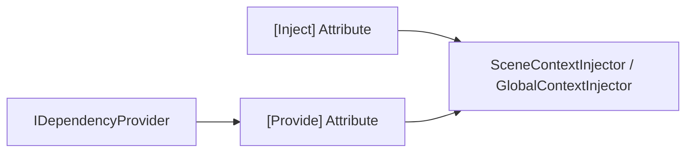
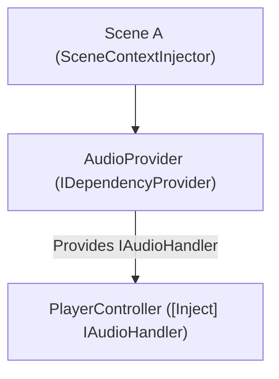
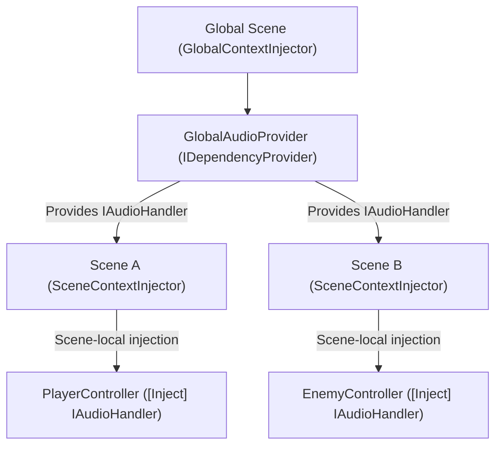

# DumbInjector
_The Dumb Injector._

DumbInjector is a lightweight, home-grown Dependency Injection (DI) framework designed for Unity. It provides simple and fast injection for both scene-local and global objects, with minimal setup. Perfect for developers who want DI without the overhead of large frameworks.

_It's like Reflex, but dumber._




## Features

- **Scene-local injection:** via `SceneContextInjector`
- **Global singleton injection:** via `GlobalContextInjector`
- **Attribute-based injection:** `[Inject]` for fields, properties, and methods
- **Provider system:** `[Provide]` methods in `IDependencyProvider` for registering injectable services
- **Minimal boilerplate:** lightweight and fast
- **Extensible core:** The `Main` assembly is the entry point for extension for your providers.
- **Usable injectors:** `Injectors` prefabs can be used as-is without being extended

## Usage

### 1. Setting Up Scene Context Injectors

DumbInjector is **scene-scoped**, meaning each scene requires a context injector to resolve dependencies correctly.  

### 2. **Setup Context Injector Prefab Setup**
  Each individual scene (except the global one) should have a `SceneContextInjector` prefab. It will:
  - Scan all root GameObjects for `[Inject]` attributes
  - Resolve dependencies from scene-local providers first
  - Resolve Global Providers if needed.
  
### 3. **Global Context Injector Prefab setup (for additive scene setups)**
  Place this prefab in a persistent "Global" scene. It will automatically:
  - Scan the scene for `[Inject]` attributes
  - Register all `IDependencyProvider` outputs
  - Inject dependencies into scene objects

 ### 4. Provide dependencies
   Any component you want to inject must have a corresponding Provider that implements `IDependencyProvider` and exposes it via a `[Provide]` method. The injector will not magically create instances — it relies on providers to supply dependencies.

```csharp
// Example Component Provider
using DumbInjector;
using UnityEngine;

public class PlayerProvider : MonoBehaviour, IDependencyProvider
{
    [SerializeField] PlayerHealth playerHealth;

    [Provide]
    IHasHealth ProvidePlayerHealth() => playerHealth;
}
```

```csharp
// Example Component Provider
using DumbInjector;
using UnityEngine;

public class AudioProvider: MonoBehaviour, IDependencyProvider
{
    [SerializeField] AudioLogger audioLogger;

    [Provide]
    IAudioHandler ProvideAudio() => audioLogger;
}
```

### 5. Injecting Dependencies

Simply decorate fields, properties, or methods with `[Inject]`:

```csharp
public class PlayerController : MonoBehaviour
{
    [Inject] IHasHealth health;
    [Inject] IAudioHandler audio;

    private void Start()
    {
        health.TakeDamage(10);
        audio.PlaySound("spawn");
    }
}
```

No singleton handling is required in your consumers — everything is injected automatically, let the dumb injectors handle that for you.

### 6. Additive-Scene Setup

When using a `GlobalContextInjector` in a globla scene alongside other scene-local's `SceneContextInjector`, it is **crucial that the global context is initialized first**. This ensures that any dependencies registered globally are available to scene-local injectors.

You can achieve this in one of the following ways:

1. **Additive Scene Setup:** Load the global scene additively before loading other scenes, ensuring its injector is active.
2. **Set Global as Active Scene:** Make the global scene the currently active scene before loading other scenes.
3. **Scene Load Order:** Make sure the global scene is the very first scene loaded in your game’s build settings.

> ⚠️ **Note:** The framework does not automatically manage execution order between global and scene-local injectors. This design gives you full control and flexibility over your initialization flow. Make sure the global injector is initialized before any scene-local injectors to ensure all dependencies are correctly resolved.

## Scene-local vs Global Injection Structures

The **DumbInjector** framework works on a **scene-scoped model**:

- **SceneContextInjector**: lives in each scene and handles injections for objects **within that scene**.
- **GlobalContextInjector**: lives in a persistent "Global" scene and provides **cross-scene services** that survive scene transitions.

### Scene-Scoped Flow


### Global-Scoped Flow



## Technical Details

### Reflection-Based Injection

DumbInjector leverages **C# reflection** to automatically discover and inject dependencies:

- **[Inject] attributes:** Applied to fields, properties, or methods. The injector scans each object’s members at runtime and sets them automatically.
- **[Provide] attributes:** Used inside `IDependencyProvider` implementations. These methods expose instances that can be injected elsewhere.
- **Scene-scoped reflection:** Instead of scanning the entire project every time, the injector caches injectable types per scene. This ensures fast lookups and minimal runtime overhead.
- **Global fallback:** SceneContextInjector resolves dependencies from local providers first, then falls back to the global injector if no local provider is available.

This approach allows you to write clean, decoupled code without manually wiring dependencies, while still being fully dynamic and flexible.


