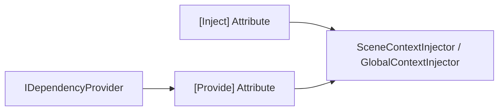
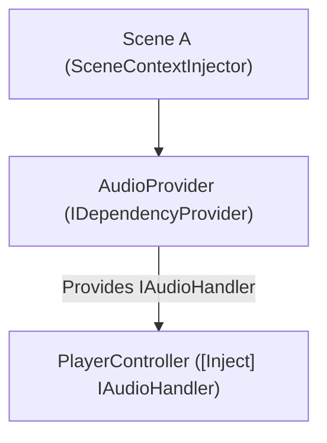
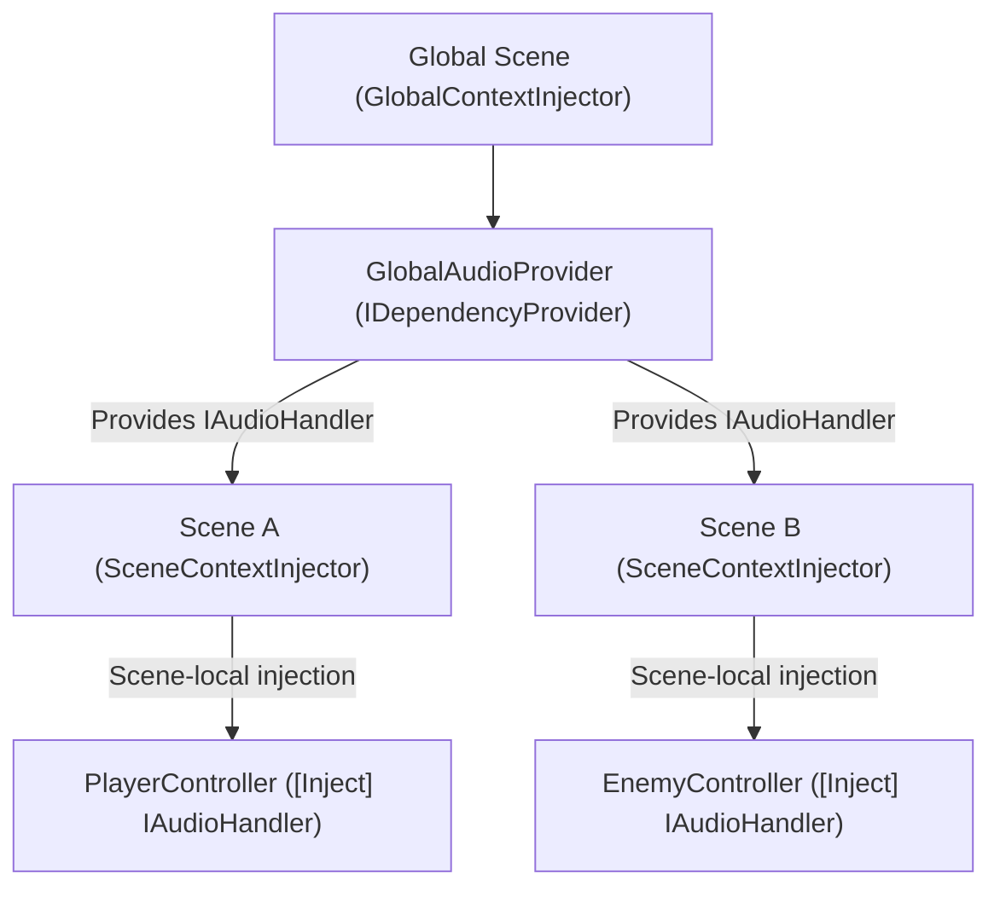

# DumbInjector
_The Dumb Injector._

DumbInjector is a lightweight, home-grown Dependency Injection (DI) framework designed for Unity. It provides simple and fast injection for both scene-local and global objects, with minimal setup. Perfect for developers who want DI without the overhead of large frameworks.

_It's like Reflex, but dumber._




## Features

- **Scene-local injection:** via `SceneContextInjector`
- **Global singleton injection:** via `GlobalContextInjector`
- **Attribute-based injection:** `[Inject]` for fields, properties, and methods
- **Provider system:** `[Provide]` methods in `IDependencyProvider` for registering injectable services
- **Minimal boilerplate:** lightweight and fast
- **Extensible core:** The `Main` assembly is the entry point for extension for your providers.
- **Usable injectors:** `Injectors` prefabs can be used as-is without being extended

## Setup

DumbInjector is **scene-scoped**, meaning each scene requires a context injector to resolve dependencies correctly.  

### 1. **Setup Context Injector Prefab Setup**
  Each individual scene (except the global one) should have a `SceneContextInjector` prefab. It will:
  - Scan all root GameObjects for `[Inject]` attributes
  - Resolve dependencies from scene-local providers first
  - Resolve Global Providers if needed.
  
### 2. **Global Context Injector Prefab setup (for additive scene setups)**
  Place this prefab in a persistent "Global" scene. It will automatically:
  - Scan the scene for `[Inject]` attributes
  - Register all `IDependencyProvider` outputs
  - Inject dependencies into scene objects

### 3. Additive-Scene Setup

When using a `GlobalContextInjector` in a globla scene alongside other scene-local's `SceneContextInjector`, it is **crucial that the global context is initialized first**. This ensures that any dependencies registered globally are available to scene-local injectors.

You can achieve this in one of the following ways:

1. **Additive Scene Setup:** Load the global scene additively before loading other scenes, ensuring its injector is active.
2. **Set Global as Active Scene:** Make the global scene the currently active scene before loading other scenes.
3. **Scene Load Order:** Make sure the global scene is the very first scene loaded in your game’s build settings.

> ⚠️ **Note:** The framework does not automatically manage execution order between global and scene-local injectors. This design gives you full control and flexibility over your initialization flow. Make sure the global injector is initialized before any scene-local injectors to ensure all dependencies are correctly resolved.

## Scene-local vs Global Injection Structures

The **DumbInjector** framework works on a **scene-scoped model**:

- **SceneContextInjector**: lives in each scene and handles injections for objects **within that scene**.
- **GlobalContextInjector**: lives in a persistent "Global" scene and provides **cross-scene services** that survive scene transitions.

### Scene-Scoped Flow


### Global-Scoped Flow


## Usage
After you got your scenes setup, it's _Dumb Injecting_ time!
 ### 1. Provide dependencies
   Any component you want to inject must have a corresponding Provider that implements `IDependencyProvider` and exposes it via a `[Provide]` method. The injector will not magically create instances — it relies on providers to supply dependencies.

```csharp
// Example Component Provider
using DumbInjector;
using UnityEngine;

public class PlayerProvider : MonoBehaviour, IDependencyProvider
{
    [SerializeField] PlayerHealth playerHealth;

    [Provide]
    IHasHealth ProvidePlayerHealth() => playerHealth;
}
```

```csharp
// Example Component Provider
using DumbInjector;
using UnityEngine;

public class AudioProvider: MonoBehaviour, IDependencyProvider
{
    [SerializeField] AudioLogger audioLogger;

    [Provide]
    IAudioHandler ProvideAudio() => audioLogger;
}
```

### 2. Injecting Dependencies

Simply decorate fields, properties, or methods with `[Inject]`:

```csharp
public class PlayerController : MonoBehaviour
{
    [Inject] IHasHealth health;
    [Inject] IAudioHandler audio;

    private void Start()
    {
        health.TakeDamage(10);
        audio.PlaySound("spawn");
    }
}
```

No singleton handling is required in your consumers — everything is injected automatically, let the dumb injectors handle that for you.

## Injection Methods

There are three primary ways to trigger dependency injection in the system:

### 1. Start Injection via Scene Context

Each scene can have a **SceneContextInjector** (or a **GlobalContextInjector** in persistent scenes) that automatically handles injection for all existing objects when the scene loads. This ensures that dependencies are populated without manually attaching `AutoInjector` to every object.

**How it works:**
- The context injector scans all root `GameObjects` in the scene.
- Recursively visits all children.
- Injects any `[Inject]` fields, properties, or methods.
- Registers any `IDependencyProvider`s it finds for later resolution.

**SceneContextInjector**
```csharp
public class SceneContextInjector : MonoBehaviour, IInjector
{
    readonly HashSet<Type> _injectableTypes = new();
    readonly Dictionary<Type, object> _sceneRegistry = new();
    bool _typesCached;

    private void Awake()
    {
        CacheInjectableTypes();
        InjectSceneObjects();
    }
   ... 
}
```

### 2. Automatic Dynamic Injection (Recommended)

Attach the **`AutoInjector`** component to any `MonoBehaviour` that requires dependencies. On `Awake()`, `AutoInjector` automatically resolves and injects all `[Inject]` fields and methods. It will first look for a **scene context injector**, and if none is found, it falls back to a **Global context injector**.

#### Example: 
```csharp
// With the AutoInjector component attached.
public class PlayerController : MonoBehaviour
{
    [Inject] private IAudioHandler audioHandler;

    private void OnEnable()
    {
        audioHandler.Play("SpawnSound");
    }
}
```

#### Unity Setup

1. Add your `MonoBehaviour` (e.g., `PlayerController`) to a `GameObject`.
2. Add the `AutoInjector` component to the same `GameObject`.
3. The `[Inject]` fields and methods will be automatically populated before `Start()` executes.

### 3. Manual Scene Injection

For objects already present in the scene or instantiated at runtime that cannot have `AutoInjector` attached, you can manually inject dependencies using a scene or global injector.

**Example:**
```csharp
[SerializeField] SceneContextInjector _injector;
_injector.Inject(existingGameObject);
```
This will scan the `GameObject` and all its children for `[Inject]` attributes. Dependencies are resolved and injected automatically.

**Tip:** For most use cases, `AutoInjector` is sufficient and preferred. Manual injection provides flexibility for complex scene setups or dynamic objects.

### Advanced Usage

- You can inject through the `IInjector` interface if you want to work with a custom injector implementation without relying on the default scene or global injectors.
- You can also use the `Builder` singleton directly to create or manage your own injector and still resolve dependencies using the same `[Inject]` attributes.


```csharp
using System;
    /// <summary>
    /// Interface for all injectors.
    /// </summary>
    public interface IInjector
    {
        void Inject(object mb);
        object Resolve(Type t);
    }
```

### Example CustomInjector
```csharp
using System;
using System.Collections.Generic;
using System.Linq;
using System.Reflection;
using DumbInjector;

/// <summary>
/// A simple custom injector for demonstration purposes.
/// </summary>
public class CustomInjector : IInjector
{
    readonly Dictionary<Type, object> _registry = new();
    const BindingFlags flags = BindingFlags.Instance | BindingFlags.Public | BindingFlags.NonPublic;

    /// <summary>
    /// Register an instance for a given type.
    /// </summary>
    public void Register<T>(T instance)
    {
        var type = typeof(T);
        if (_registry.ContainsKey(type))
        {
            throw new InvalidOperationException($"Type {type.Name} is already registered.");
        }
        _registry[type] = instance;
    }

    /// <summary>
    /// Inject dependencies into fields or properties marked with [Inject].
    /// </summary>
    public void Inject(object obj)
    {
        if (obj == null) return;

        
        // Inject fields
        foreach (var field in obj.GetType().GetFields(flags)
                     .Where(f => Attribute.IsDefined(f, typeof(InjectAttribute))))
        {
            var resolved = Resolve(field.FieldType);
            if (resolved != null) field.SetValue(obj, resolved);
        }

        // Inject properties
        foreach (var prop in obj.GetType().GetProperties(flags)
                     .Where(p => Attribute.IsDefined(p, typeof(InjectAttribute)) && p.CanWrite))
        {
            var resolved = Resolve(prop.PropertyType);
            if (resolved != null) prop.SetValue(obj, resolved);
        }
    }

    /// <summary>
    /// Resolve an instance for a given type.
    /// </summary>
    public object Resolve(Type t)
    {
        _registry.TryGetValue(t, out var instance);
        return instance;
    }

    /// <summary>
    /// Generic resolve helper.
    /// </summary>
    public T Resolve<T>()
    {
        return (T)Resolve(typeof(T));
    }
}
```

### Example Factory
```csharp
// Example usage:
public class ExampleUsage
{
    public void Setup()
    {
        var injector = new MyCustomInjector();
        
        var player = new PlayerController();
        injector.Inject(player); // Dependencies injected automatically
    }
}
```

Or you can do things like...
```csharp
// Exampple Orchestrator
public class EnemyFactory
{
    IInjector _injector;
    public EnemyFactory(IInjector injector)
    {
        _injector = injector;
    }

    public GameObject CreateEnemy(GameObject prefab)
    {
        var instance = GameObject.Instantiate(prefab);

        // Example 1: Inject only the main component you know requires dependencies.
        var enemyComponent = instance.GetComponent<Enemy>();
        _injector.Inject(enemyComponent);

        // Example 2: Inject all MonoBehaviours in the prefab and its children.
        var allComponents = instance.GetComponentsInChildren<MonoBehaviour>(true);
        foreach (var comp in allComponents)
        {
            _injector.Inject(comp);
        }
    }
}
```

## Code Execution Order

Correct execution timing is critical for dependency injection to work reliably.

### Scene-Scoped Injection

The **SceneContextInjector** runs **before any `Awake()` methods** of your scene’s `MonoBehaviour`s.  

This ensures that all `[Inject]` dependencies are already resolved when components initialize.  

As a result, for most scene-scoped injections, you don’t need extra setup — it works out of the box.

---
### Cross-Scene Injection

Like previously mentioned, for dependencies that persist across multiple scenes (e.g., `AudioProvider`, `PlayerController`), injection requires **manual handling**.  

In these cases, a **GlobalContextInjector** should be initialized as early as possible (e.g., via a **bootstrap scene** or `[RuntimeInitializeOnLoadMethod]`).  

This guarantees that global providers are registered before new scenes are loaded, allowing injection to succeed even across additive scenes.

### Execution Flow

1. **GlobalContextInjector** *(optional, cross-scene)* → Registers global providers early.  
2. **SceneContextInjector** *(per scene)* → Resolves scene-local providers and applies injections.  
3. **MonoBehaviour.Awake()** → Runs with all required dependencies already injected.  
4. **MonoBehaviour.Start()** → Safe to use injected dependencies for gameplay logic.  

## Technical Details

### Reflection-Based Injection

DumbInjector leverages **C# reflection** to automatically discover and inject dependencies:

- **[Inject] attributes:** Applied to fields, properties, or methods. The injector scans each object’s members at runtime and sets them automatically.
- **[Provide] attributes:** Used inside `IDependencyProvider` implementations. These methods expose instances that can be injected elsewhere.
- **Scene-scoped reflection:** Instead of scanning the entire project every time, the injector caches injectable types per scene. This ensures fast lookups and minimal runtime overhead.
- **Type caching optimization**: The injector caches all injectable types (`[Inject]` fields, properties, methods, and IDependencyProviders) once per scene or globally. This avoids repeated reflection scans at runtime, improving performance when injecting multiple objects.
- **Global fallback:** SceneContextInjector resolves dependencies from local providers first, then falls back to the global injector if no local provider is available (and if there's any global context to begin with).

This approach allows you to write clean, decoupled code without manually wiring dependencies, while still being fully dynamic and flexible.

## Things to improve
- I'm pretty sure I'm missing C# constructor plain classes injections. 
- Better debugging tools. 
- Better architectural tooling.

## References

- **Reflex** – A lightweight dependency injection framework for Unity. Useful for understanding attribute-based injection and runtime resolution.  
  [GitHub](https://github.com/gustavopsantos/Reflex) 

- **Zenject** – A popular DI framework for Unity supporting scene contexts, global containers, and automatic injection. Great inspiration for context-based injection patterns.  
  [Zenject Documentation](https://github.com/modesttree/Zenject)

- **[Youtube Video](https://youtu.be/PJcBJ60C970)** – Demonstrates Unity dependency injection patterns and best practices:  
  


